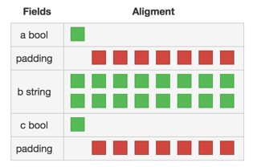
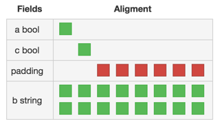

# Size of structs

The size depends on the types it consists of and the order of the fields in the struct (because different padding will
be used). This means that two structs with the same fields can have different size.

